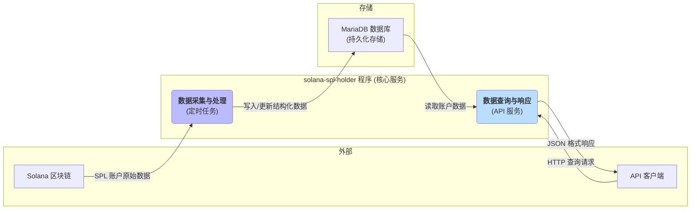

# solana-spl-holder

Solana SPL holder

- spl
- holder
  - blacklist
  - topN
  - supply

```
A tool to periodically fetch Solana SPL token holders and provide a query API.

Usage:
  solana-spl-holder [flags]

Flags:
      --db_conn string      MariaDB连接串 (default "root:123456@tcp(localhost:3306)/solana_spl_holder?charset=utf8mb4&parseTime=True&loc=Local")
  -h, --help                help for solana-spl-holder
      --interval_time int   Interval in seconds for fetching data (default 300)
      --listen_port int     HTTP service listening port (default 8090)
      --rpc_url string      Solana node RPC URL (default "https://api.devnet.solana.com")
```

## MariaDB

创建数据库
```
CREATE DATABASE solana_spl_holder
CHARACTER SET utf8mb4
COLLATE utf8mb4_general_ci;
```

初始化配置表
```
USE solana_spl_holder;


-- 创建 SPL Token 表
CREATE TABLE IF NOT EXISTS spl (
    id INT AUTO_INCREMENT PRIMARY KEY,
    symbol VARCHAR(255) NOT NULL,
    mint_address VARCHAR(255) NOT NULL,
    created_at DATETIME DEFAULT CURRENT_TIMESTAMP,
    updated_at DATETIME DEFAULT CURRENT_TIMESTAMP ON UPDATE CURRENT_TIMESTAMP,
    UNIQUE KEY unique_mint_address (mint_address)
) CHARACTER SET utf8mb4 COLLATE utf8mb4_general_ci;

INSERT INTO spl (symbol, mint_address) VALUES
('TSLAx', 'XsDoVfqeBukxuZHWhdvWHBhgEHjGNst4MLodqsJHzoB'),
('AAPLx', 'XsbEhLAtcf6HdfpFZ5xEMdqW8nfAvcsP5bdudRLJzJp'),
('NVDAx', 'Xsc9qvGR1efVDFGLrVsmkzv3qi45LTBjeUKSPmx9qEh'),
('AMZNx', 'Xs3eBt7uRfJX8QUs4suhyU8p2M6DoUDrJyWBa8LLZsg'),
('COINx', 'Xs7ZdzSHLU9ftNJsii5fCeJhoRWSC32SQGzGQtePxNu'),
('HOODx', 'XsvNBAYkrDRNhA7wPHQfX3ZUXZyZLdnCQDfHZ56bzpg'),
('GOOGLx', 'XsCPL9dNWBMvFtTmwcCA5v3xWPSMEBCszbQdiLLq6aN');

-- 创建 SPL Token Holder 表
CREATE TABLE IF NOT EXISTS holder (
    id BIGINT AUTO_INCREMENT PRIMARY KEY,
    
    -- Token 相关
    mint_address VARCHAR(255) NOT NULL,
    
    -- 持有者信息
    pubkey VARCHAR(255) NOT NULL,
    lamports BIGINT NOT NULL,
    is_native TINYINT(1) NOT NULL,  -- 0 = false, 1 = true
    owner VARCHAR(255) NOT NULL,
    state VARCHAR(50) NOT NULL,
    decimals INT NOT NULL,
    
    -- 金额相关
    amount DECIMAL(38,0) NOT NULL,
    ui_amount DECIMAL(38,6) NOT NULL,
    ui_amount_string VARCHAR(255) NOT NULL,
    
    -- 时间戳
    created_at DATETIME DEFAULT CURRENT_TIMESTAMP,
    updated_at DATETIME DEFAULT CURRENT_TIMESTAMP ON UPDATE CURRENT_TIMESTAMP,
    
    -- 索引
    UNIQUE KEY unique_holder_mint_pubkey (mint_address, pubkey),
    INDEX idx_mint_address (mint_address),
    INDEX idx_pubkey (pubkey)
) CHARACTER SET utf8mb4 COLLATE utf8mb4_general_ci;

```

## Arch



## APIs

### 默认列表

curl "http://localhost:8090/holders"

### 分页列表

curl "http://localhost:8090/holders?page=2&limit=1"

### 过滤列表

curl "http://localhost:8090/holders?mint_address=Xs3eBt7uRfJX8QUs4suhyU8p2M6DoUDrJyWBa8LLZsg"


### 排序列表

curl "http://localhost:8090/holders?sort=-lamports"
