# Solana SPL Token Holder Tracker

[](https://golang.org/)
[](LICENSE)
[](#)

一个高性能的 Solana SPL Token 持有者追踪工具，提供实时数据采集、存储和查询 API 服务。

## ✨ 特性

- 🔄 **实时数据采集**: 定时从 Solana 区块链获取 SPL Token 持有者信息
- 🚀 **高性能 API**: 提供 RESTful API 进行数据查询和分析
- 📊 **多维度查询**: 支持分页、多字段排序、状态过滤、地址过滤等多种查询方式
- 🪙 **SPL Token 管理**: 完整的 CRUD API 支持 SPL Token 配置管理
- 🗄️ **持久化存储**: 使用 MariaDB 进行数据持久化存储
- 🌐 **多网络支持**: 支持 Devnet、Localnet 和 Mainnet
- 📈 **监控友好**: 内置健康检查和状态监控端点
- 🛠️ **开发友好**: 完整的开发工具链和测试框架

## 🏗️ 项目结构

```
solana-spl-holder/
├── server/                 # 核心服务代码
│   └── main.go            # 主程序入口
├── setup/                 # 数据库和初始化脚本
│   ├── init_database.sql  # 数据库初始化脚本
│   └── README.md          # 设置说明文档
├── test/                  # 测试文件
│   ├── api_test.go        # API 测试
│   └── README.md          # 测试说明文档
├── build/                 # 构建输出目录
├── Makefile              # 构建和开发工具
├── go.mod                # Go 模块依赖
├── go.sum                # 依赖校验文件
├── devnet.sh             # 开发网络启动脚本
├── localnet.sh           # 本地网络启动脚本
├── mainnet.sh            # 主网启动脚本
└── README.md             # 项目说明文档
```

## 🚀 快速开始

### 环境要求

- Go 1.21 或更高版本
- MariaDB 10.3 或更高版本
- Make 工具

### 安装和构建

1. **克隆项目**
   ```bash
   git clone <repository-url>
   cd solana-spl-holder
   ```

2. **安装依赖**
   ```bash
   make deps
   ```

3. **构建应用**
   ```bash
   make build
   ```

4. **初始化数据库**
   ```bash
   make init-db
   ```

### 运行服务

#### 开发环境 (Devnet)
```bash
make run-dev
# 或者
make dev  # 包含依赖安装、格式化、检查等完整流程
```

#### 本地测试网络
```bash
make run-local
```

#### 主网环境
```bash
# 需要设置 SOLANA_RPC 环境变量
export SOLANA_RPC="your-mainnet-rpc-url"
make run-mainnet
```

## 🛠️ 开发工具

### 可用的 Make 命令

```bash
make help           # 显示所有可用命令
make build          # 构建应用程序
make clean          # 清理构建文件
make test           # 运行测试
make test-coverage  # 运行测试并显示覆盖率
make fmt            # 代码格式化
make vet            # 代码静态检查
make dev            # 开发环境快速启动
make prod           # 生产环境构建
make install        # 安装到系统路径
make uninstall      # 从系统路径卸载
```

### 开发流程

1. **代码格式化**
   ```bash
   make fmt
   ```

2. **代码检查**
   ```bash
   make vet
   ```

3. **运行测试**
   ```bash
   make test
   ```

4. **启动开发服务**
   ```bash
   make dev
   ```

## 📊 数据库配置

### 创建数据库

```sql
CREATE DATABASE solana_spl_holder
CHARACTER SET utf8mb4
COLLATE utf8mb4_general_ci;
```

### 数据库初始化

使用提供的初始化脚本：

```bash
make init-db
```

或手动执行：

```bash
mysql -u root -p < setup/init_database.sql
```

### 数据库表结构

- **spl**: SPL Token 配置表
- **holder**: Token 持有者信息表

详细的表结构和字段说明请参考 [setup/README.md](setup/README.md)。

## 🌐 API 文档

服务启动后，可以通过以下端点访问：

- **API 文档**: http://localhost:8091/
- **健康检查**: http://localhost:8091/health
- **持有者查询**: http://localhost:8091/holders

### 主要 API 端点

#### 1. 健康检查
```bash
curl http://localhost:8091/health
```

**响应示例：**
```json
{
  "success": true,
  "data": {
    "status": "healthy",
    "version": "1.0.0",
    "build_time": "2024-01-01 12:00:00 UTC",
    "git_commit": "abc123",
    "bin_name": "solana-spl-holder"
  }
}
```

#### 2. 获取持有者列表
```bash
# 默认列表
curl "http://localhost:8091/holders"

# 分页查询
curl "http://localhost:8091/holders?page=2&limit=10"

# 按 Token 过滤
curl "http://localhost:8091/holders?mint=Xs3eBt7uRfJX8QUs4suhyU8p2M6DoUDrJyWBa8LLZsg"

# 按状态过滤
curl "http://localhost:8091/holders?state=frozen"     # 查询冻结状态的持有者
curl "http://localhost:8091/holders?state=initialized" # 查询已初始化状态的持有者

# 排序查询
curl "http://localhost:8091/holders?sort=ui_amount"   # 按金额升序排序
curl "http://localhost:8091/holders?sort=-ui_amount"  # 按金额降序排序
curl "http://localhost:8091/holders?sort=pubkey"      # 按公钥升序排序
curl "http://localhost:8091/holders?sort=-pubkey"     # 按公钥降序排序

# 组合查询示例
curl "http://localhost:8091/holders?mint=Xs3eBt7uRfJX8QUs4suhyU8p2M6DoUDrJyWBa8LLZsg&state=frozen"
curl "http://localhost:8091/holders?state=initialized&sort=-ui_amount"  # 查询已初始化状态并按金额降序
curl "http://localhost:8091/holders?mint=Xs3eBt7uRfJX8QUs4suhyU8p2M6DoUDrJyWBa8LLZsg&state=initialized&sort=ui_amount&page=1&limit=10"
```

#### 3. Holder 状态更新 API

**接口：** `PUT /holders/{mint}/{pubkey}`

**描述：** 更新指定 Holder 的状态

**路径参数：**
- `mint`: Token 的 mint 地址
- `pubkey`: Holder 的公钥地址

**请求体：**
```json
{
  "state": "frozen"
}
```

**支持的状态值：**
- `uninitialized`: 未初始化
- `initialized`: 已初始化
- `frozen`: 已冻结

**请求示例：**
```bash
curl -X PUT "http://localhost:8091/holders/Xs3eBt7uRfJX8QUs4suhyU8p2M6DoUDrJyWBa8LLZsg/13nkreFLoEtJ5rRpknHtAUgKH1yo2CychKrtVuBLmwdf" \
  -H "Content-Type: application/json" \
  -d '{"state": "frozen"}'
```

**成功响应：**
```json
{
  "success": true,
  "data": {
    "id": 22,
    "mint": "Xs3eBt7uRfJX8QUs4suhyU8p2M6DoUDrJyWBa8LLZsg",
    "pubkey": "13nkreFLoEtJ5rRpknHtAUgKH1yo2CychKrtVuBLmwdf",
    "state": "frozen",
    "owner": "6Vmny6y3mLA4kaDTjnZJabvZ8jLKQBg4aqbaERHmEeLZ",
    "amount": "200121791",
    "uiAmount": 2.001218,
    "decimals": 8,
    "updatedAt": "2025-09-14T15:36:09+08:00"
  }
}
```

**错误响应：**
```json
{
  "success": false,
  "error": "state必须是以下值之一: [uninitialized initialized frozen]"
}
```

#### 5. 查询参数说明

| 参数 | 类型 | 说明 | 示例 |
|------|------|------|------|
| `page` | int | 页码 (从1开始) | `page=2` |
| `limit` | int | 每页数量 (1-100) | `limit=20` |
| `mint` | string | Token 地址过滤 | `mint=Xs3e...` |
| `state` | string | 状态过滤 (uninitialized/initialized/frozen) | `state=frozen` |
| `sort` | string | 排序字段，支持 ui_amount 和 pubkey，前缀 `-` 表示降序 | `sort=-ui_amount` |

##### 排序参数详细说明

| 排序参数 | 说明 | 示例 |
|----------|------|------|
| `sort=ui_amount` | 按持有金额升序排序 | 从小到大排列 |
| `sort=-ui_amount` | 按持有金额降序排序 | 从大到小排列 |
| `sort=pubkey` | 按持有者公钥升序排序 | 字母顺序 A-Z |
| `sort=-pubkey` | 按持有者公钥降序排序 | 字母顺序 Z-A |

##### 过滤参数组合使用

可以同时使用多个过滤参数进行精确查询：

```bash
# 查询特定 Token 的已初始化持有者，按金额降序排列
curl "http://localhost:8091/holders?mint=Xs3eBt7uRfJX8QUs4suhyU8p2M6DoUDrJyWBa8LLZsg&state=initialized&sort=-ui_amount"

# 查询冻结状态的持有者，按公钥升序排列，分页显示
curl "http://localhost:8091/holders?state=frozen&sort=pubkey&page=1&limit=10"
```

### 响应格式

```json
{
  "data": [
    {
      "id": 1,
      "mint": "Xs3eBt7uRfJX8QUs4suhyU8p2M6DoUDrJyWBa8LLZsg",
      "pubkey": "holder_address",
      "lamports": 2039280,
      "owner": "owner_address",
      "amount": "1000000",
      "ui_amount": 1.0,
      "ui_amount_string": "1",
      "decimals": 6,
      "created_at": "2024-01-01T00:00:00Z",
      "updated_at": "2024-01-01T00:00:00Z"
    }
  ],
  "pagination": {
    "page": 1,
    "limit": 20,
    "total": 100,
    "total_pages": 5
  }
}
```

## 🧪 测试

### 运行测试

```bash
# 运行所有测试
make test

# 运行测试并显示覆盖率
make test-coverage

# 运行特定测试
cd test && go test -v
```

### 测试结构

- `test/api_test.go`: API 端点测试
- `test/README.md`: 测试说明和指南

## 🏗️ 架构设计

```mermaid
graph LR
    subgraph "外部服务"
        Solana["🌐 Solana 区块链"]
        Client["👤 API 客户端"]
    end

    subgraph "核心服务"
        Collector["📥 数据采集器<br/>(定时任务)"]
        API["🚀 API 服务器<br/>(HTTP 服务)"]
    end

    subgraph "存储层"
        DB["🗄️ MariaDB<br/>(持久化存储)"]
    end

    %% 数据流
    Solana -->|"SPL 账户数据"| Collector
    Collector -->|"结构化数据"| DB
    Client -->|"HTTP 请求"| API
    DB -->|"查询结果"| API
    API -->|"JSON 响应"| Client

    %% 样式
    style Collector fill:#e1f5fe
    style API fill:#f3e5f5
    style DB fill:#e8f5e8
```



## ⚙️ 配置选项

### 命令行参数

```bash
./solana-spl-holder [flags]

Flags:
  --db_conn string      MariaDB 连接字符串
                        (default "root:123456@tcp(localhost:3306)/solana_spl_holder?charset=utf8mb4&parseTime=True&loc=Local")
  --interval_time int   数据采集间隔时间(秒) (default 300)
  --listen_port int     HTTP 服务监听端口 (default 8091)
  --rpc_url string      Solana RPC 节点地址 (default "https://api.devnet.solana.com")
  -h, --help           显示帮助信息
```

### 环境变量

- `SOLANA_RPC`: Solana RPC 节点地址
- `DB_CONN`: 数据库连接字符串
- `LISTEN_PORT`: HTTP 服务端口
- `INTERVAL_TIME`: 数据采集间隔

## 📝 许可证

本项目采用 MIT 许可证。详情请参阅 [LICENSE](LICENSE) 文件。

## 🤝 贡献

欢迎提交 Issue 和 Pull Request！

1. Fork 本项目
2. 创建特性分支 (`git checkout -b feature/amazing-feature`)
3. 提交更改 (`git commit -m 'Add some amazing feature'`)
4. 推送到分支 (`git push origin feature/amazing-feature`)
5. 开启 Pull Request

## 📞 支持

如果您在使用过程中遇到问题，请：

1. 查看 [API 文档](http://localhost:8091/) (服务运行时)
2. 查看 [测试文档](test/README.md)
3. 查看 [设置文档](setup/README.md)
4. 提交 Issue

---

**Happy Coding! 🚀**
